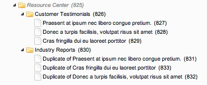

FISSx
=====

Filterable Infinite Scroll Snippet

==
##### AUTHORS #####

Wayne Roddy (@dubrod)

Jan Peca    (@TheBoxer)

==
**Published**

2014/04/25 on a late friday night

==

This snippet should be used to create one of those cool Infinite Scroll (or not) Content Sections with a Filterable Category Listings. There is **no frontend** code including, that should be customized to your design.

==

### Step 1 ###

**Dummy Content and Category Structure**



==

### Step 2 ###

**Create your Category List**

If your resource tree looks like the above you should be able to use *getResources* by default to get the list like this:

```
<ul id="category_list">
	<li class="cat_item active"><a href="javascript:void(0)" class="all">Show All</a></li>
					 	
	[[!getResources? &parents=`[[*id]]` &tpl=`infinite-parent-list` &sortby=`menuindex` &sortdir=`ASC` &limit=`5` &includeTVs=`1` &depth=`1` &where=`{"template:=":XXX}`]]

</ul>
```

***Don't forget to insert your template ID for this page**

This Page is ran on the **ROOT Page aka Grandparent**

==

### Step 3 ###

**CHUNK: infinite-parent-list**

```
<li class="cat_item">
  <a href="javascript:void(0)" class="[[+alias]]">[[+pagetitle]]</a> 
</li>
```

**NOTE:** We are using the alias as the filterable class.

==

### Step 4 ###

**SNIPPET: fissx**

Goes in your main content section.

```
[[fissx? &tpl=`infinity_resources`]]
```

==

### Step 5 ###

**CHUNK: infinite-resources**

```
<article class="infinite_item [[+category_alias]]">
    <a href="[[+alias]]">
	<div class="infinite_item_media">
		
	</div>
	<div class="infinite_item_content">
		<h3>[[+category_pagetitle]]</h3>
		<h1>[[+pagetitle]]</h1>
	</div>
    </a>
</article>
```

**Note:** We have a Thumbnail Template Variable, the rest is defaulted


